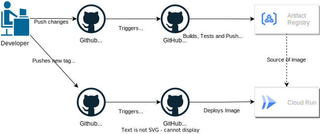

# What is it

It is minimal viable REST application project deployable on Google Cloud Platform (GCP).
## Assumptions

- Deployable on GCP, and using only [GCP's Free Tier](https://cloud.google.com/free) services.
- Terraform used for managing infrastructure.
- Simplified CI/CD workflows on GitHub Actions.
- Only one environment is created (no staging, prod etc.), but can be easily extended.
- Application is implemented in [nest.js framework](https://github.com/nestjs/nest).

# Architecture


Cloud Run service is used as a host of application,
Firestore service is used as a datastore.

# Deployment pipeline



There are two workflows in solution, one is responsible for  building and other for  deployment.

**Building process is triggered by new commits pushed into repository, it:**
- Executes tests and linting.
- Builds production docker image.
- Pushes image to Artifact Registry, images are tagged with SHA of commit.

**Deployment process is triggered by pushing tag in form `v*-dev`**.

Process deploys to Cloud Run image with give commit's SHA.

# Preparing project

Follow next steps to deploy solution on own GCP's project or run it locally.
## Setup project

 1. Create project on https://console.cloud.google.com/projectcreate it need to be unique across GCP
 1. Create github fork of this repository to be able use GitHub Actions on your account.
 1. Copy `.env.template` and rename it to `.env`
   1. Fill `TF_VAR_project_id`  with id created project.
   1. Fill `TF_VAR_github_owner`  with name of your user/org on github.
   1. Fill `TF_VAR_github_repo`  with name of repository
 1. Follow instructions on https://cloud.google.com/billing/docs/how-to/modify-project#enable_billing_for_a_project to add billing account to project, it is required to create new resources.
 1. Generate certificate used by  terraform and during local development.
    1. Go to Service Accounts settings: https://console.cloud.google.com/iam-admin/serviceaccounts
    1. Click `Create service account` button
    1. Fill `Name`,`Account ID` and add `Description` i used `terraform`.
    1. Click `Create and continue` Button.
    1. Click on `Select a Role` dropdown and select `Owner`
    1. Click `Done`
    1. Click newly created account on list.
    1. Switch to "Keys" Tab.
    1. Click on "Add key" and select "Create new Key", pick `JSON` type on modal.
    1. Certificate should be downloaded.
1. Rename certificate to `cert.json` and move it to root directory of project.

## Creating Infrastructure

1. Use `docker-compose run --rm terraform` to enter terraform environment.
1. Type `terraform init` to initialize state files.
1. Type `terraform apply` to see plan, then type `yes` and confirm with enter to create infrastructure.

### Getting outputs
Use bellow snipet to get service URL and values used in github integration
```
terraform output app_url
terraform output wif_provider_id
terraform output wif_service_account_email
```
## Github Action integration

To configure authentication of GitHub Actions in GCP two secrets needs to be set in Actions Secrets: https://docs.github.com/en/actions/security-guides/using-secrets-in-github-actions#creating-secrets-for-a-repository

Below secrets are needed:

- `WIF_PROVIDER` - value of terraform output `wif_provider_id` from previous section
- `WIF_SERVICE_ACCOUNT`  value of terraform output `wif_service_account_email` from previous section

# Running local
Before running app localy you need to [Setup Project](##setup-project).

Use command:
```
docker-compose up app
``` 
Application will be available on `localhost:8080`
# Local development

Before running app localy you need to [Setup Project](##setup-project).

Navigate to `app/` directory.
```
cd app/
```
### Instaling dependecies
```
npm install
```
### Starting development
```
npm run start:dev
```
It will start application on port `3000`.

### Resting and linting
To run tests use:
```
npm run test
```
To execute linting:
```
npm run lint
```

